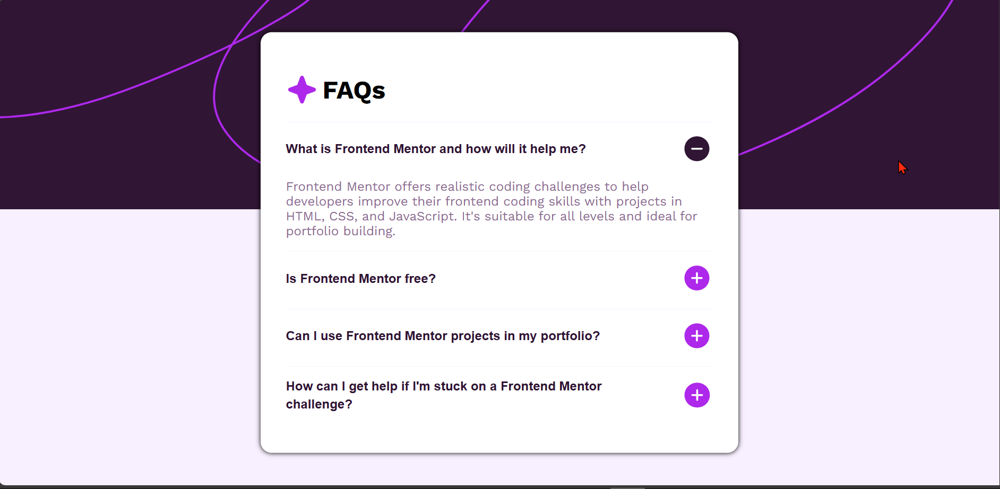
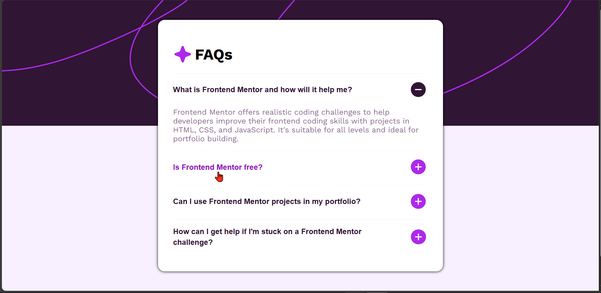
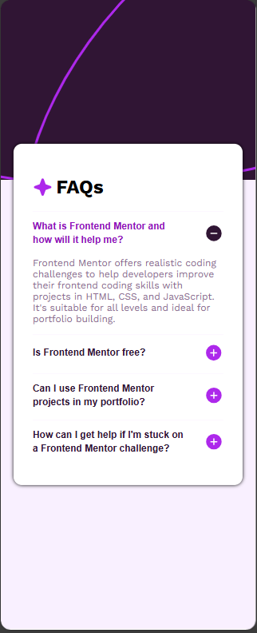

# Frontend Mentor - FAQ accordion solution

This is a solution to the [FAQ accordion challenge on Frontend Mentor](https://www.frontendmentor.io/challenges/faq-accordion-wyfFdeBwBz). Frontend Mentor challenges help you improve your coding skills by building realistic projects.

## Table of contents

- [Frontend Mentor - FAQ accordion solution](#frontend-mentor---faq-accordion-solution)
	- [Table of contents](#table-of-contents)
	- [Overview](#overview)
		- [The challenge](#the-challenge)
		- [Screenshot](#screenshot)
		- [Links](#links)
	- [My process](#my-process)
		- [Built with](#built-with)
		- [What I learned](#what-i-learned)
		- [Continued development](#continued-development)
		- [Useful resources](#useful-resources)
	- [Author](#author)
	- [FAQ ACCORDION](#faq-accordion)

## Overview

### The challenge

Users should be able to:

- Hide/Show the answer to a question when the question is clicked
- Navigate the questions and hide/show answers using keyboard navigation alone
- View the optimal layout for the interface depending on their device's screen size
- See hover and focus states for all interactive elements on the page

### Screenshot





### Links

- Solution URL: [Preview project source code](https://github.com/jidoG8/FAQ-ACCORDION.git)
- Live Site URL: [Preview the live project](https://jidog8.github.io/FAQ-ACCORDION/)

## My process

### Built with

- Semantic HTML5 markup
- CSS custom properties
- Flexbox
- CSS Grid
- Mobile-first workflow
- [JavaScript](https://developer.mozilla.org/en-US/docs/Web/JavaScript)

### What I learned

- I learned How to use element.nextElementSibling property in JavaScript.
- I also learned how to use the element.querySelector() with different DOM elements

To see how you can add code snippets, see below:

```html
<article class="faq">
	<!-- FAQ HEADER -->
	<header class="faq__header">
		
		<h1 class="faq__title">FAQs</h1>
	</header>

	<!-- FAQ ITEMS -->
	<!-- First FAQ Item -->
	<button class="faq__question" type="button">
		<span class="faq__question-text"
			>What is Frontend Mentor and how will it help me?</span
		>
		
		
	</button>
	<p class="faq__answer">
		Frontend Mentor offers realistic coding challenges to help developers
		improve their frontend coding skills with projects in HTML, CSS, and
		JavaScript. It's suitable for all levels and ideal for portfolio building.
	</p>

	<ul class="faq__list">
		<!-- Second FAQ Item -->
		<li class="faq__item">
			<button class="faq__question" type="button">
				<span class="faq__question-text">Is Frontend Mentor free?</span>
				
				
			</button>
			<p class="faq__answer">
				Yes, Frontend Mentor offers both free and premium coding challenges,
				with the free option providing access to a range of projects suitable
				for all skill levels.
			</p>
		</li>
		<!-- Second FAQ Item -->
		<li class="faq__item">
			<button class="faq__question faq_qnt-1" type="button">
				<span class="faq__question-text"
					>Can I use Frontend Mentor projects in my portfolio?</span
				>
				
				
			</button>
			<p class="faq__answer">
				Yes, you can use projects completed on Frontend Mentor in your
				portfolio. It's an excellent way to showcase your skills to potential
				employers!
			</p>
		</li>
		<!-- Second FAQ Item -->
		<li class="faq__item">
			<button class="faq__question" type="button">
				<span class="faq__question-text"
					>How can I get help if I'm stuck on a Frontend Mentor challenge?</span
				>
				
				
			</button>
			<p class="faq__answer">
				The best place to get help is inside Frontend Mentor's Discord
				community. There's a help channel where you can ask questions and seek
				support from other community members.
			</p>
		</li>
	</ul>
</article>
```

```css
.faq__question:focus {
	outline: none;
	color: var(--purple-600);
}

.faq__question-text {
	display: flex;
	font-weight: var(--fw600);
	color: var(--purple-950);
	justify-content: flex-start;
	line-height: 1.4;
	text-align: left;
	font-size: 1rem;
	font-weight: var(--fw600);
}

.faq__question:hover .faq__question-text {
	color: var(--link-color);
}
```

```js
/**
 * @date: 2025/11/17
 * @description: Frontend Mentor | FAQ accordion
 */

// Get all FAQ question buttons
const faqButtons = document.querySelectorAll(".faq__question");

faqButtons.forEach((button) => {
	button.addEventListener("click", () => {
		faqButtons.forEach((btn) => {
			// close open buttons w/n another is clicked
			btn.addEventListener("click", () => {
				faqButtons.forEach((otherBtn) => {
					if (otherBtn !== btn) {
						const otherAnswer = otherBtn.nextElementSibling;
						const otherPlusIcon = otherBtn.querySelector(".faq__icon--plus");
						const otherMinusIcon = otherBtn.querySelector(".faq__icon--minus");

						otherAnswer.style.display = "none";
						otherPlusIcon.style.display = "block";
						otherMinusIcon.style.display = "none";
					}
				});
			});
		});

		// display Selected button text
		const answer = button.nextElementSibling;
		const plusIcon = button.querySelector(".faq__icon--plus");
		const minusIcon = button.querySelector(".faq__icon--minus");

		// display button text on 1st click & close on second click
		if (answer.style.display === "block") {
			answer.style.display = "none";
			plusIcon.style.display = "block";
			minusIcon.style.display = "none";
		} else {
			answer.style.display = "block";
			plusIcon.style.display = "none";
			minusIcon.style.display = "block";
		}
	});
});
```

### Continued development

- I feel i need more practice on JavaScript concepts such as Event handlers.
- I need to revisit some CSS concept as well as they all seem challenging at times

### Useful resources

- [MDN docs](https://developer.mozilla.org/en-US/docs/Web/API/Element/nextElementSibling) - Learned about element.nextElementSiblings property
- [stackoverFlow](https://stackoverflow.com/questions/72223022/how-do-i-prevent-my-web-page-from-being-resized-smaller-than-a-certain-size) - Resize a web page.

## Author

- Frontend Mentor - [@jidoG8](https://www.frontendmentor.io/profile/jidoG8)
- Twitter - [@OjjaC1253](https://x.com/OjjaC1253)
- LinkedIn - [@ojja-caesar](https://www.linkedin.com/in/ojja-caesar-134980345/)

## FAQ ACCORDION
